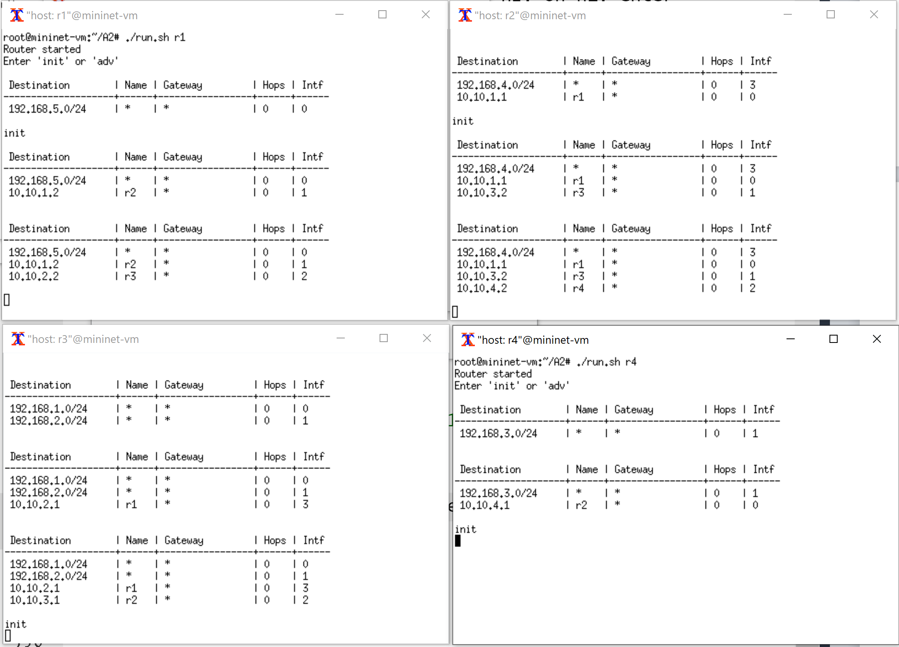

# Image-caption-generator

The task is generating captions for images using a pre-trained CNN as a feature extractor and a transformer as a sequence generator.

The input to the problem is a 224 x 224 colored image represented by a (3 x 224 x 224) tensor and the final output is a sequence of words as the caption to the image.

## Model:


### Transformer model parameters:

We ignore VGG-16 parameters since we use transfer learning:

- Flattened Feature Map Linear + batch norm: 147,904
- Caption Embedding + batch norm: 562,112
- Transformer: 183,040
- Final MLP: 570,765

Total: 1,463,821 total learnable parameters

### Simple RNN model parameters:
- Feature Map MLP + batch norm: 6,214,268
- Caption Embedding + batch norm: 878,300
- GRU: 274,944
- Final MLP: 2,256,717

Total: 9,624,229 total learnable parameters


### Model Examples
<!--  -->

## Data

The dataset we are using is FLickr8k. Source: https://www.kaggle.com/datasets/adityajn105/flickr8k


There are 8091 images in the dataset, each with 5 captions.
The following statistics about the captions are outputted by code (see notebook):

```
Highest caption length: 35

Longest caption: <bos> an africanamerican man wearing a green sweatshirt and blue vest is holding up  dollar bills in front of his face  while standing on a busy sidewalk in front of a group of men playing instruments <eos>

Lowest caption length: 1

Shortest caption: <bos> a <eos>

Average caption length: 10.785761957730813

Vocabulary size: 8781

10 most common words: ['a', 'in', 'the', 'on', 'is', 'and', 'dog', 'with', 'man', 'of']

10 least common words: ['swatting', 'containig', 'rainstorm', 'breezeway', 'cocker', 'spaniels', 'weight', 'majestically', 'scrolled', 'patterns']
```

Note that vocabulary size includes 3 special tokens that we added: \<bos\>, \<eos\>, \<pad\>. They each has an index in the vocab dictionary.
```
Index of <bos>: 0

Index of <eos>: 15

Index of <pad>: 8780
```


Since most of the images in the dataset are not square, we take the largest possible square crop of the image and then scale the image down to 224x224, then we extract the RGB channels of the image to get a 3x224x224 tensor for each image. We also have the option of padding all images into squares, by adding black pixels to the smaller dimension of the image, then scaling the image down to 224x224 and splitting the RGB channels to get a 3x224x224 tensor.

For the captions, we find all distinct words and create a vocabulary dictionary that maps each word to a distinct integer. Then we convert the strings of captions into lists of indices but we also prepend a \<bos> token and append a \<eos> token. But since each image is associated with 5 different captions, we instead create a list of captions for each image. Another important transformation of the captions occurs when training. Since we train in batches and the captions in a batch are not necessarily the same length, we pad the smaller captions so that we can fit the batched captions as a tensor.


The training, validation and test splits are 6000 training images, 1000 validation images, and 1091 testing images with all 5 of their respective captions.

## Training

<!-- Put training curves here -->

Since we had 2 different options in terms of preprocessing the images (cropping vs padding), we tried training with both types of images and found no significant difference in the loss or accuracy curves.

### Hyperparameter tuning
We began our training with learning rate of 0.01, batch size of 30, and 10 epochs. We noticed the loss graph is oscillating a lot and the curve continued to decrease after 10 epochs, thus we decided to use a lower learning rate of 0.001 and increased our epoch number to 30. However, the convergence of our loss curve takes too much time. Eventually we decided to set our learning rate to 0.002 to speed up convergence. After the change, we realized that the training time is too slow so we increased our batch size to 60. 


## Results

### Quantitative Measure
Since our result is a sentence and not a simple classification, to quantitatively measure the accuracy of our model, we use Bleu score to calculate the similarities between the predicted caption and the 5 ground truth captions. The Bleu score is expected to be low because it is just mechanically matching individual words or sequence of 2,3,4 words between the sentences being compared. However, we are not expecting the model to generate the same exact sentence as one of the 5 ground truth captions, but rather generate a caption that is true to the image. Even different human beings may focus on different details and use different words of similar meanings when describing the same image. With that being said, we still need a quantitative way to measure the model's accuracy for the purpose of plotting a training curve and observing the trend to detect over fitting.

Bleu score for each image is calculated as the maximum bleu score of the generated caption with each of the 5 ground truth captions, and the bleu score of the generated caption with each ground truth caption is calculated as average(bleu1, bleu2, bleu3, bleu4). The accuracy of the model on a set of data is calculated as the average bleu score on all the images of the dataset. See get_accuracy function in the notebook for more detail. Since bleu score is a value between 0 and 1, we interpret it as a percentage. 

### Quantitative and Qualitative Results
The model achieved training accuracy of % by the end of training, but only % on the validation set and % on the testing set. It is expected to be low, as mentioned above. In the training curve, But to see how well it really learned, the best way is to manually look at the captions generated on some images and use human judgement.

## Ethical Consideration
This model can be used to serve those who are visually impaired, as it gives them a way to “see” images with texts that summarize the image, which can then be recited to them by software. It also may be used in album management softwares to conveniently group photos by content. It also may raise concerns if this model is applied in a surveillance tool to understand images captured with security cameras, which can then be used to track people’s activities without their knowledge. Such examples, like Amazon which implements machine learning cameras to monitor their workers. This creates a hostile working environment that inflates the company’s power on eliminating union formation and other threats that the company considered. 

## Authors

