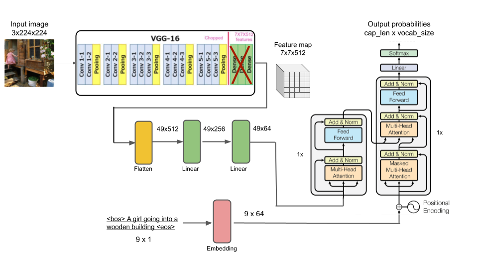
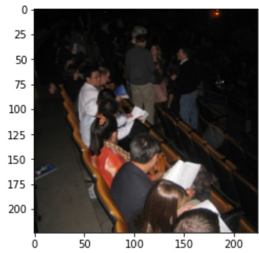
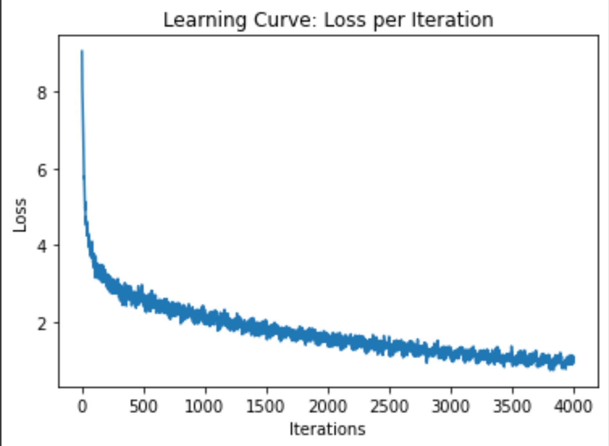
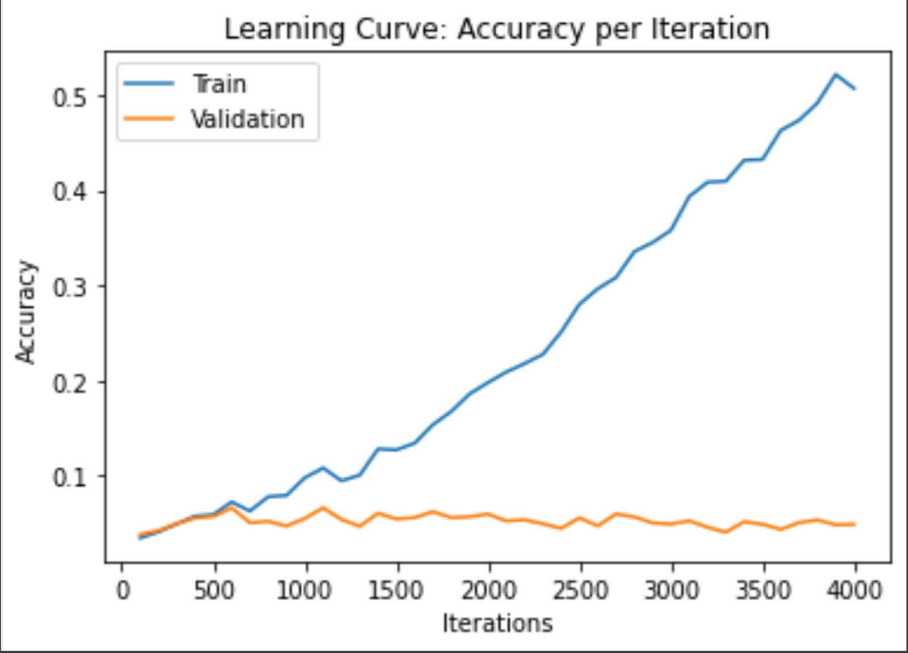
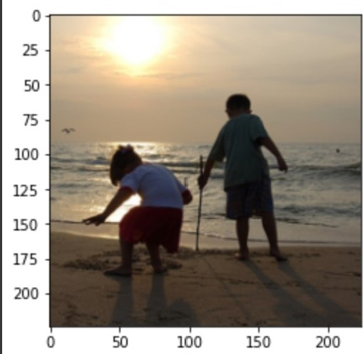
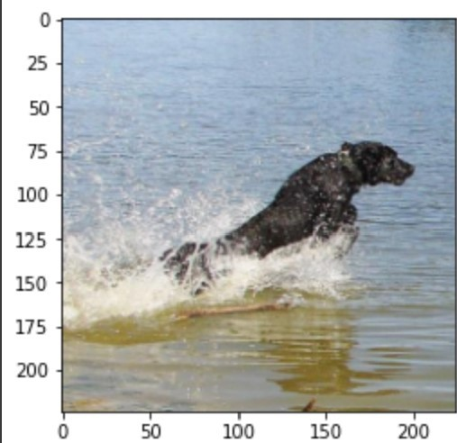
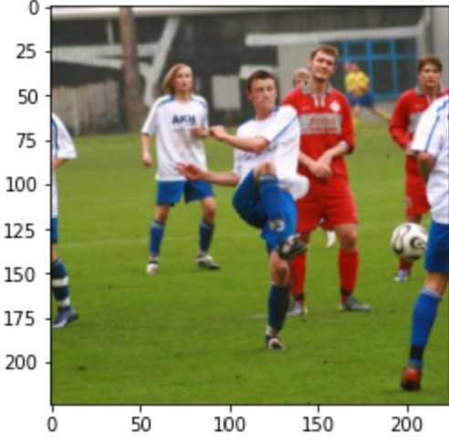
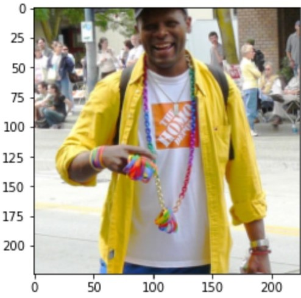
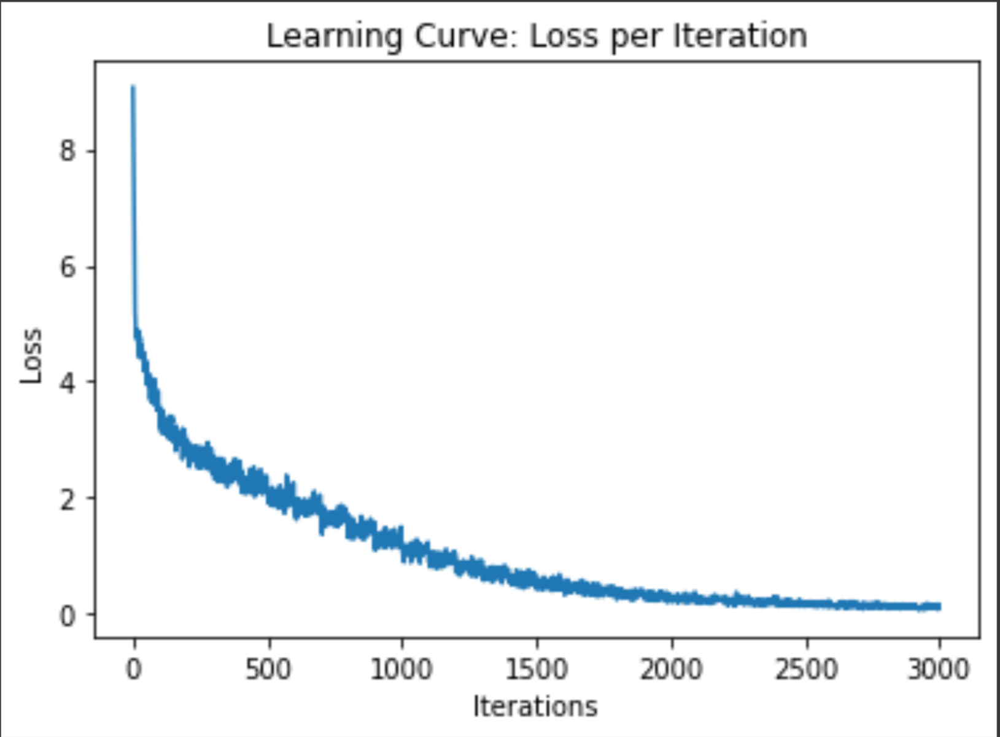
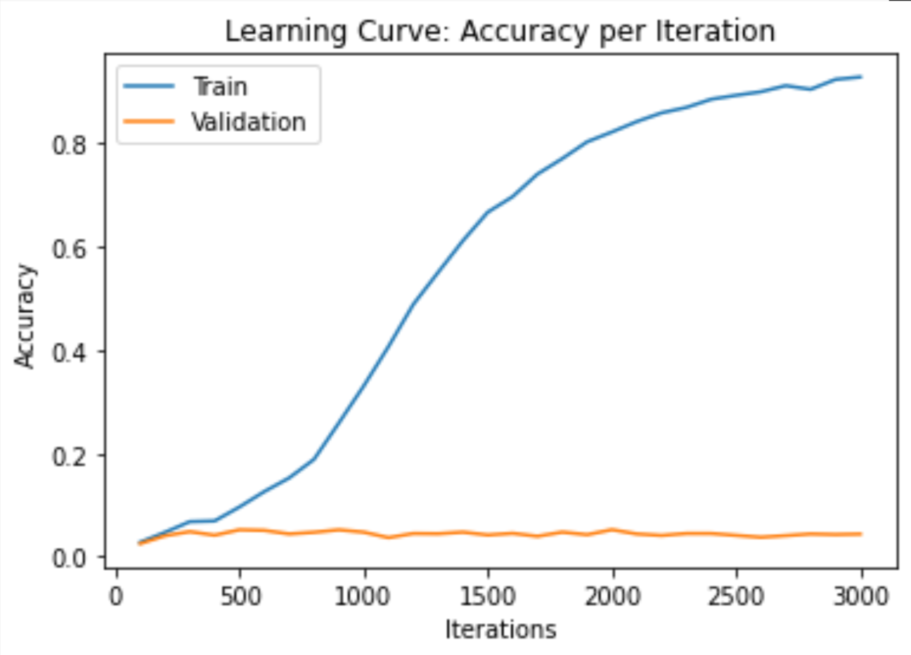

# Image-caption-generator

The task is generating captions for images using a pre-trained CNN as a feature extractor and a transformer as a sequence generator.

The input to the problem is a 224 x 224 colored image represented by a (3 x 224 x 224) tensor and the final output is a sequence of words as the caption to the image.

## Model:





## Model parameters:

### Transformer model parameters:

We have code that prints out the shapes of every trainable parameter in the model, see in notebook. We ignore VGG-16 parameters since we use transfer learning. We then just add up the sizes of parameters in each component to obtain the following numbers:

- Flattened Feature Map Linear + batch norm: 147,904
- Caption Embedding + batch norm: 562,112
- Transformer: 183,040
- Final MLP: 570,765

Total: 1,463,821 total learnable parameters

### Simple RNN model parameters:
We also created a simple caption generator to compare the results of the above model to it. 

- Feature Map MLP + batch norm: 6,214,268
- Caption Embedding + batch norm: 878,300
- GRU: 274,944
- Final MLP: 2,256,717

Total: 9,624,229 total learnable parameters


## Model Examples
Successful example:


Prediction: 
- a child is skateboarding on a sidewalk

Real captions: 

    1. a boy skateboards and does a jump over another skateboard

    2. a skateboarder attempts to do a trick over a homemade ramp

    3. a skateboarder in gray clothes jumps over a boot in front of an apartment

    4. a skateboarder is jumping over an obstacle in front of a white house

    5. a skateboarder jumps another skateboard

Unsuccessful example:



Prediction: 
- a man in a black hat and white hat sitting on a man in a silly string hat 

Real captions

    1. a group of people are sitting in some rows of wooden seats

    2. a group of people seated in a line of seats at an event

    3. people sit in an auditorium with programs

    4. people sitting in rows of seats

    5. students are sitting in an auditorium with notes out in front of them

## Data 

The dataset we are using is Flickr8k. Source: https://www.kaggle.com/datasets/adityajn105/flickr8k


There are 8091 images in the dataset, each with 5 captions.
The following statistics about the captions are outputted by code (see notebook):

```
Highest caption length: 35

Longest caption: <bos> an africanamerican man wearing a green sweatshirt and blue vest is holding up  dollar bills in front of his face  while standing on a busy sidewalk in front of a group of men playing instruments <eos>

Lowest caption length: 1

Shortest caption: <bos> a <eos>

Average caption length: 10.785761957730813

Vocabulary size: 8781

10 most common words: ['a', 'in', 'the', 'on', 'is', 'and', 'dog', 'with', 'man', 'of']

10 least common words: ['swatting', 'containig', 'rainstorm', 'breezeway', 'cocker', 'spaniels', 'weight', 'majestically', 'scrolled', 'patterns']
```

Note that the shortest caption is just 'a' and some of the least common words are misspelled. We made sure that is what the dataset actually has, not a mistake on our end.

Note that vocabulary size includes 3 special tokens that we added: \<bos\>, \<eos\>, \<pad\>. They each have an index in the vocab dictionary.
```
Index of <bos>: 0

Index of <eos>: 15

Index of <pad>: 8780
```


Since most of the images in the dataset are not square, we take the largest possible square crop of the image and then scale the image down to 224x224, then we extract the RGB channels of the image to get a 3x224x224 tensor for each image. We also have the option of padding all images into squares, by adding black pixels to the smaller dimension of the image, then scaling the image down to 224x224 and splitting the RGB channels to get a 3x224x224 tensor.

For the captions, we find all distinct words and create a vocabulary dictionary that maps each word to a distinct integer. We excluded all symbols in the captions, such as punctuations. Then we convert the strings of captions into lists of indices but we also prepend a \<bos> token and append a \<eos> token. But since each image is associated with 5 different captions, we instead create a list of captions for each image. Another important transformation of the captions occurs when training. Since we train in batches and the captions in a batch are not necessarily the same length, we pad the smaller captions so that we can fit the batched captions as a tensor.


The training, validation and test splits are 6000 training images, 1000 validation images, and 1091 testing images with all 5 of their respective captions.

## Training Curve

### Transformer





### Hyperparameter tuning
Since we had 2 different options in terms of preprocessing the images (cropping vs padding), we tried training with both types of images and found no significant difference in the loss/accuracy curves and quality of the caption.

We began our training with learning rate of 0.01, batch size of 30, and 10 epochs. We noticed the loss graph is oscillating a lot and not getting low enough in 10 epochs, thus we decided to use a lower learning rate of 0.001 and increased our epoch number to 40. However, the convergence of our loss curve takes too much time. Eventually we decided to set our learning rate to 0.002 to speed up convergence. After the change, we realized that the training time is still too slow so we increased our batch size to 60, to allow for more parallel computations.

## Results

### Quantitative Measure
Since our result is a sentence and not a simple classification, to quantitatively measure the accuracy of our model, we use Bleu score to calculate the similarities between the predicted caption and the 5 ground truth captions. The Bleu score is expected to be low because it is just mechanically matching individual words or sequence of 2,3,4 words between the sentences being compared. However, we are not expecting the model to generate the same exact sentence as one of the 5 ground truth captions, but rather generate a caption that is true to the image. Even different human beings may focus on different details and use different words of similar meanings when describing the same image. With that being said, we still need a quantitative way to measure the model's accuracy for the purpose of plotting a training curve and observing the trend to detect over fitting.

Bleu score for each image is calculated as the maximum bleu score of the generated caption with each of the 5 ground truth captions, and the bleu score of the generated caption with each ground truth caption is calculated as average(bleu1, bleu2, bleu3, bleu4). The accuracy of the model on a set of data is calculated as the average bleu score on all the images of the dataset. See get_accuracy function in the notebook for more detail. Since bleu score is a value between 0 and 1, we interpret it as a percentage. 

### Quantitative and Qualitative Results
The model achieved training accuracy of about 50% by the end of training, but only 5% on the validation set and 5% on the testing set. The training curve shows that training accuracy keeps rising the longer we train, and can potentially reach 100%, but the validation accuracy just flat-lines around 5%. The training accuracy rising while the validation accuracy flat-lines just means the model is memorizing the training data, and the 5% validation accuracy shows the limitation of how well this model actually performs. As mentioned above, validation accuracy (bleu score) is low as expected, and its magnitude is not a good representation of the model's performance.

To see how well it really learned, the best way is to manually look at the captions generated on some images and use human judgement. By going through the testing set and looking at the model's generated captions as well as the original captions (see show_img_and_pred in the notebook), we found out that the model's captions are mostly relevant to the image, i.e. being able to identify the main objects and the background, but most of the captions are not as detailed as the original captions and misunderstands the image in some ways. The most common mistakes we observed are stating the color of the clothes on people wrong, misidentifying the gender and age of people, and misidentifying the relationship between objects in the image.

Below are some example outputs that demonstrate the limitation of the model:



Prediction: two men walking on the beach

This one is a minor mistake, the model just misidentified the age of the people.



Prediction: a black dog is climbing in the water

This one is an example where the model did not understand the action. The dog's pose may look like climbing something if the background is not just water, but in this image there is nothing to climb.



Prediction: a baseball player about to catch the ball

For the image, the model misidentified the context of the image. It has trouble identifying the sport from the background, people's clothes and the ball itself.



Prediction: a man in a red jacket looks at a parade

For this image, the model got the color of the jacket wrong, and it thought the group of people in the background is a parade, which is excusable. But one important detail is that the man is facing away from the crowd so he can not be looking at it. It is a nuanced detail about the spacial relationship between objects in the image that the model cannot understand, e.g. who is in the front, who is in the back, who is facing which way.


Prediction: a man in a black hat and white hat sitting on a man in a silly string hat

This image demonstrates that the model gets confused when there are too many objects in an image, especially when they are crammed together and overlapping. In this case the model cannot tell which object is which.

### Justification of Results:

Given the difficulty of learning to describe a picture with words, the model performed reasonably well. For a model to perform well on such a task, it must learn more than just identifying the objects in an image, but also many complicated ideas about the relationships between the objects, their relation to the setting, the actions that the objects are doing, etc. For example, the model needs to understand what is the subject of the image, what is the direct object, what action is the subject doing to the object, why does the action make sense in the locational setting. It also must understand that objects can be displayed in many different ways, something that our model failed to do. For example, the same object appears bigger when closer and smaller when farther away, objects may overlap, objects look different from different angles. This information is naturally understood by humans because we are used to living in a 3D space, but the model is only receiving 2D information, so we figured it would be challenging for the model to interpret 3 dimensional spatial information.

But in general, our model was able to understand very general things about the pictures. It could determine what the main object in the picture was and relate that to a decently accurate understanding of the setting of the image. And it was able to take this information and provide a caption that is mostly relevant to the image and consistently have correct English grammar. 

To better understand how well this model does and to compare it to other models that have been used for this task, we created a very simple model caption generator. The architecture for this model uses a CNN to extract the feature maps of the image as well, but then it passes this to a large MLP which is used to learn a latent vector that encodes as much info about the image that it can. This vector is then passed into a GRU as the initial hidden state in order to translate the image into a caption. All of the code for this can be found in the notebook, this model is called SimpleCaptionGenerator. 

We trained this model as well for 30 epochs. The training accuracy was able to reach over 90%, which means it can memorize the training set very well, but the validation accuracy is still flat-lined at around 5% (See the training curves in the notebook and attached below). This means adding significantly more neurons to understand the image still resulted in a model with the same performance.






## Ethical Consideration
This model can be used to serve those who are visually impaired, as it gives them a way to “see” images with text that summarizes the image, which can then be recited to them by software. It also may be used in album management softwares to conveniently group photos by content. It also may raise concerns if this model is applied in a surveillance tool to understand images captured with security cameras, which can then be used to track people’s activities without their knowledge. Such examples, like Amazon which implements machine learning cameras to monitor their workers. This creates a hostile working environment that inflates the company’s power on eliminating union formation and other threats that the company considered. 


